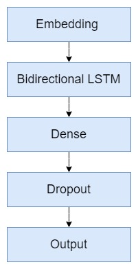

# MIDAS @ IIITD Summer Internship - Task 3: Natural Language Processing

# Assignment Details-
Use a given dataset to build a model to predict the category using description. Write code in python. Using Jupyter notebook is encouraged. 

* Show how you would clean and process the data
* Show how you would visualize this data
* Show how you would measure the accuracy of the model
* What ideas do you have to improve the accuracy of the model? What other algorithms would you try?

About Data : You have to clean this data, In the product category tree separate all the categories, figure out the primary category, and then use the model to predict this.
If you want to remove some categories for lack of data, you are also free to do that, mention this with explanation and some visualization.
Questions are made this way to check if candidates are able to understand this.


Note:
1) Goal is to predict the product category.
2) Description should be the main feature. Feel free to use other features if it'd improve the model.
3) Include a Readme.pdf file with approach in detail and report the accuracy and what models were used.

[Dataset link](https://docs.google.com/spreadsheets/d/1pLv0fNE4WHokpJHUIs-FTVnmI9STgog05e658qEON0I/edit?usp=sharing)

<br>

# Approach
<br>


<br>
<br>

## Step 1: Cleaning

Like in most text classification problems, my first step here was to clean the text. I took the description column, removed rows with null values and used the following pipeline: 

```python
cleaning_pipeline = [
        ("expanding_contractions", pipelinize(expandContractions)),
        ("tokenizer", pipelinize(tokenize_and_remove_punct)),
        ("pos", pipelinize(tags)),
        ("lemmatizing", pipelinize(lemmatize)),
        ("removing_stopwords",pipelinize(stopword_removal))
            ]
```

So, let's go through each one of them:

1) Expanding Contraction: simply take a word, if it's a contraction then return the expanded form, else return as is. (eg: can't -> can not)

2) Tokenize and remove punctuations: Tokenizing each word using *nltk.tokenize.MWETokenizer* and remove all the punctuation  marks as they add no value here.

3) Tagging: tagging the tokens using *nltk.pos_tag* (reason explained in next point)

4) Lemmatization: lemmatization using *nltk.stem.WordNetLemmatizer* of tokens who have a *pos_tag*, otherwise pass token unchanged

5) Stopwords: Removing unnecessary token from the text


This was all to clean the description. But, the category column is very messy too.

For most values in the *product_category_tree*, a tree of categories is given (eg: Clothing>>Men's Clothing>>T Shirts>>Round Neck Tshirts).

It is simple in this case, I just took the root of the tree as the parent category and make it the label.

What about the columns with no proper trees? We can't drop them simply because it's not a small number. In the imae below, the *NONE* category refers to the samples with no improper labels.


I planned to do some manual labelling using a dictionary which maps important key words to a category.


Example:
```python
mapping_untidy_categores = {
    "Pens & Stationery": ["paper", "sheets", "self stick", "notebook", "pen"],
    "Clothing": ["kurta", "kurti","stole", "dress", "shorts", "capri", "jeans", "top", "brief", "jumpsuit", "sleeve", "boxer", "leggings", "shirt",
                "socks", "round neck", "bra", "polo neck", "jacket", "vest", "trouser", "pyjama", "camisole", "lingerie", "blazer", "bottom",
                "sari", "cotton", "cufflink", "bangle", "hair clip", "hair band", "glove", "strap"]
}
```

> This may require domain knowledge. I chose to do it after some research for key words and basic reasoning.

Once this is done, we will have cleaned text and cleaned labels. This is the distribution now:


<br>
<br>

However, there's one more thing to be done. 

If we check the value counts of different labels, we may see that some have counts as low as 1 and 2. This is not a typical scenario for Machine Learning. Working with such small number of samples for a category will surely lead to unfavourable results. Best option is to get more data. Since that is not possible meanwhile, I chose to drop all rows having categories with count less than 25. 

Now, there are 26 unique categories for classification. 


<br>
<br>

### Wordclouds and custom stop words

Wordclouds can help us find the important topics. We can use them to find the popular words in each in each category. 

In this case, the word clouds had some eerie insights. Let's look at a few first.

<br>

<table>
  <tr>
    <td> Mobiles & Accessories  </td>
    <td> Clothing </td>
    <td> Cameras & Accessories </td>
   </tr> 
   <tr>
      <td> Home Decor & Festive Needs </td>
      <td> Jewellery </td>
      <td> Sports & Fitness </td>
  </tr>
</table>

For *Mobile & Accessories*, the top words are meaningful and add value in the context of this problem. But, there are certain words which appear in most categories and add little to no meaning to the description. These include words like brand, sale, discount, flipkart, price, free, ship, delivery.

We need to make a custom list of stopwords and pass it before word embeddings.

Here's a list of words I used as custom stopwords.

```python
STOP_WORDS = ["service", "ship", "flipkart", "product", "geniune", "delivery", "online", "best", "price", "discount", "free"
             "key", "feature", "guarantee", "low", "buy", "day", "flipkartcom", "shop", "rs", "brand", "india", "branded", "cash",
             "package", "sale", "days"]

```


Find the complete souce code of the cleaning pipeline in [src/clean.py](https://github.com/mananjhaveri/midas_iiitd_task/blob/main/src/clean.py).

<br>
<br>

## Step 2: Create Folds  

I consider this step very important for cross validation of model. This helps to select k equally stratified parts of data.

```python
def create_folds(data):
    data["kfold"] = -1
    data = data.sample(frac=1).reset_index(drop=True)

    kf = model_selection.StratifiedKFold(n_splits=5)
    for f, (t_, v_) in enumerate(kf.split(X=data, y=data.category.values)):
        data.loc[v_, 'kfold'] = f

    return data
```

And with this simple function, I created 5 folds in the dataset to help in cross-validation.

<br>
<br>

## Step 3: Embeddings

Machines understand numbers, not text. Now, it's time to convert the text data to numbers. We can use *CountVectorizer* but it is very basic and always underperforms compared to *TfidfVectorizer*. So I went ahead with Tfidf only.

parameters used:
```python
MAX_FEATURES = 10000
tvf = TfidfVectorizer(tokenizer=word_tokenize, token_pattern=None, ngram_range=(1, 2), max_features=MAX_FEATURES)
```
I tried different values for *MAX_FEATURES* but ultimately 10000 was the best fit. 

Find the compelete source code for embeddings in [src/tfidf.py](https://github.com/mananjhaveri/midas_iiitd_task/blob/main/src/tfidf.py).

Also, I tried to use the currently famouse and powerful *FastText* vectorization. It was computationally very heavy and my Laptop crashed thrice while trying to use it. So, went with *TfidfVectorizer* only. 

Find the compelete source code for Fast Text in [src/fast_text.py](https://github.com/mananjhaveri/midas_iiitd_task/blob/main/src/fast_text.py).

<br>
<br>
<br>
<br>
<br>

## Step 4: Resampling and/or Decomposition

As we saw earlier, categories with count less than 25 are dropped. However, 25 still may seem less. Resmapling is usually helpful to create similar samples for minority classes. 

From experience, up-sampling may have produce a favourable result in a scenario where minority class has, say, 3000 samples and it needs to be increased to 5000 samples. Going from 25 to even 500 is very likely to produce unfavourable results and introduce bias in the data.

However, I still tried up-sampling using SMOTE. But, consistent to my hypothesis, the results were unfavourable, dropping the score by 15-20%.

Next, there's Decomposition. I have chose *MAX_FEATURES* as 10000, which also means 10000 columns. That's huge. 

Even though models were training satisfactorily, I tried decomposition methods like *TruncatedSVD* and *NMF*. It helped to reduce dimension, save a few seconds in training but the model's performance was being compromised and 10000 columns wasn't taking forever. So, I chose to not add this step either to my final pipeline. 

Find the compelete source code for Resampling in [src/resampling.py](https://github.com/mananjhaveri/midas_iiitd_task/resampling.py) and for Decomposition in [src/decompose.py](https://github.com/mananjhaveri/midas_iiitd_task/decompose.py).

<br>
<br>

## Step 5: Training Models and Evaluation

I have tried few different basic ML models and an LSTM model. But, before exploring the models, it's important to decide a suitable evaluation metric. 

As seen earlier, the data is highly imbalanced; accuracy is definetly a bad choice. It's essential to manage precision and recall, both. Therefore, the most appropriate scoring metric will be F1 score. 


>                                            F1 = 2PR / (P + R)

Here, F1 = F1 score, P = precision, R = recall

Now, regarding the models, here is a small report of the scores. 

<br>
<br>


<br>
<br>

Clearly, Logistic Regression and LSTM are the top performers. But, at the same time Random Forest and Naive Baye's are also performing too well. 

We can have a look at the classification reports too to confirm that minority classes are also being predicted satisfactorily.

<br>
<br>
<br>
<br>
<br>
<br>

<table>
  <tr>
    <td>Naive Bayes</td>
    <td>Random Forest</td>
    <td>Logistic Regression</td>
   </tr> 
</table>


Let's move on to see the LSTM model's architecture.



<br>
<br>

* Embedding Layer: This layer uses *tensorflow.keras.experimental.preprocessing.TextVectorization* with max_tokens=10000, output dimension = 5000
* LSTM: A bidirectional LSTM layer with 512 *units*.
* Dense: 256 neurons, with *relu activation*
* Dropout: a 0.3 dropout layer
* Dense: Output layer with neurons equal to number of classes
* Compilation: CategoricalCrossentropy as it is a multi-classification task, optimizer = Adam(1e-4)

I tried multiple dense layers and multiple LSTM layers. But, that just seemed to be complicating thr model and overfitting on the data. It's perhaps because the data is performing well on basic models like Logistic Regression so a simple LSTM model also suffices for this task.

We can see the plots of loss and f1 score with respect to epochs here:


Find the compelete source code for Training ML models in [src/train.py](https://github.com/mananjhaveri/midas_iiitd_task/train.py) and for LSTM in [src/train_lstm.py](https://github.com/mananjhaveri/midas_iiitd_task/train_lstm.py).

<br>
<br>
<br>
<br>

# Reproducing

* Use the [requirements/requirements.txt](https://github.com/mananjhaveri/midas_iiitd_task/requirements/requirements.txt) **OR** directly reuse the virtual environment using [requirements/environment.yml](https://github.com/mananjhaveri/midas_iiitd_task/requirements/environment.yml)

* Clone this repository

* Run the file in this order (or create a shell script):
    * clean.py
    * tfidf.py 
    * train.py

    Note:
    * resample.py and decompose.py are optional (make sure the file names are consistent if using these 2 files)
    * pass ml model of choice as argument (eg: python train.py --model nb, this will use Naive Baye's model). Head to utils.py to see the model and model tag dictionary.

<br>
<br>

# Prediction on test text

Simply use the predict.py using the following command:

```shell
python predict.py --model model_of_choice
```

It will prompt for text, enter the text to be classified.

<br>
<br>

# What more can be done?
* If we get more data (and processing power), we can use robust techniques like **FastText embedding models**, **BERT transformer** (or other powerful transformer).
* **Clubbing categories** is also an option. For example, there are two different categories for *Home & Kitchen* and *Kitchen & Dining*. I am not an expert in the domain but it may see that these two can be clubbed tohether(with some domain assistance).
* **Extra features** like price, rating, etc are also available. We can surely make use of them to enhance the model.
* Image url are also provided, maybe we can train a model on those images. Then we can **ensemble Image classifier with the text classifier**.
* **Hyperparameter optimization**, a very crucial step for fine tuning of the model, is also remaining. It can provide a little boost to the models.

<br>
<br>

# Key Takeaways

Honestly, the data at first seemed intimidating becuase the category column required a lot of cleaning. But just some basic methods helped to clean it; it took some time though.

But, in the end, after completing this project, I feel it just required very simple techniques but crucial fundamental preprocessing. It's always a bad idea to dive right into Deep Learning models. Even here, the simplest model of all, Logistic Regression, is outperforming the rest. All in all, starting with very fundamental steps and building your way up is the important lesson learned.
